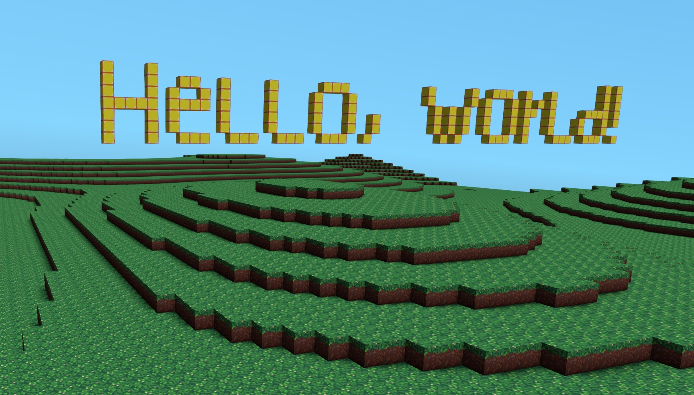

# unnamed voxel engine

This is a perpetually under-construction voxel graphics/game/demo engine written in Rust, using wgpu for rendering.

Some code has been borrowed/reused from my other Rust projects (primarily [demogine](https://github.com/paavohuhtala/demogine)), as well as popular open source projects (namely [bevy](https://bevyengine.org/)).

## Features

- Voxel world composed of 16x16x16 chunks
  - Fairly efficient palette-based storage, inspired by [Minecraft's NBT format](https://minecraft.wiki/w/Chunk_format)
- Each chunk is converted to a mesh using [greedy meshing](https://0fps.net/2012/06/30/meshing-in-a-minecraft-game/)
- GPU driven rendering
  - One mesh per chunk
    - Efficient mesh data: 8 bytes per vertex (position, texture, ambient occlusion) and 16-bit indices
  - Chunk pre-sorting (front-to-back) to minimize overdraw
  - One CPU-side draw call per frame for the entire world
  - Frustum culling & draw command generation using compute shaders
  - Mesh vertices & indices stored in GPU buffers, managed by custom memory allocators
    - `GpuHeap<T>` for variable sized data
    - `GpuPool<T>` for fixed sized data
- World textures are rendered with sharp pixels (like in Minecraft), while still supporting mipmapping & anisotropic filtering
- Baked ambient occlusion
  - 3 neighboring voxels are checked to determine the AO level for each vertex
- Voxel text rendering, using a 1-bit font texture
  - I drew a custom font texture just for this!
- Basic world generation using SuperSimplex noise
- Basic multithreading
  - World generation
  - Chunk meshing
- Procedural sky
- Post processing pipeline
  - FXAA
  - Film grain / debanding noise

## License

All code and assets are licensed under the MIT license, unless noted otherwise. See [LICENSE](LICENSE) file for details.
